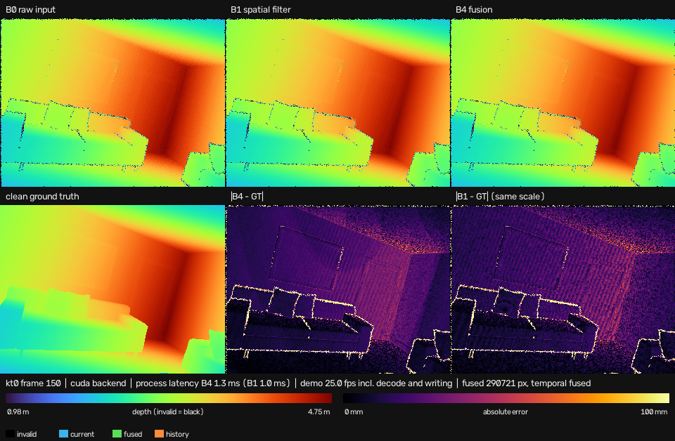

# Demo

`examples/compare_depth.py` renders one validated sequence into a six-panel comparison and
writes PNGs, an MP4 and the usual run artifacts. It needs the `demo` extra (OpenCV):

```bash
pip install -e '.[demo]'    # already included in '.[dev]'

python examples/compare_depth.py --manifest data/icl/kt0/manifest.json \
    --config configs/icl.yaml --backend cuda --frames 200 \
    --sixth-panel error_b1 --panel-width 320 \
    --output runs/demo/kt0 --save-video runs/demo/kt0/demo.mp4
```



Frame 150 of kt0, produced by exactly the command above. The right wall shows what the
numbers in [RESULTS.md](RESULTS.md) say: `|B4 - GT|` is visibly darker and less speckled than
`|B1 - GT|` at the same millimetre scale, while both keep the same bright edges, where the
error is dominated by the input's gross outliers rather than by the filter.

## Panels

| Panel | Content |
|---|---|
| B0 raw input | the noisy depth, sanitised with the engine's own validity rule |
| B1 spatial filter | the mask-aware bilateral filter alone (no pose, so no temporal stage) |
| B4 fusion | the full method |
| clean ground truth | the evaluator's clean depth, when the sequence has a clean variant |
| \|B4 - GT\| | absolute error of the full method |
| sixth panel | `source` (default), `confidence` or `error_b1` — see below |

`--sixth-panel source` colours where each pixel came from (current, fused, history-only,
invalid), `confidence` shows the display score, and `error_b1` puts `|B1 - GT|` next to
`|B4 - GT|` on the same scale, which is the panel to use when comparing the two methods.

## Scales

Every depth panel in a run uses the same metre range and the same colormap; every error panel
the same millimetre range. Both are fixed before the first frame is rendered and written into
`summary.json`, so what the video shows can be checked afterwards. The depth range is taken
from a few frames spread over the run (not from the first frame, which would saturate
everything once the camera has moved) unless `--depth-range MIN_M MAX_M` sets it explicitly;
`--error-max-mm` sets the error scale, 100 mm by default.

Invalid pixels are black in every panel. A panel with no data — an error panel for a sequence
without a clean variant, for instance — says so in the panel instead of showing zeros that
would read as a perfect result.

## The three times are not interchangeable

The status line and `summary.json` keep them apart, as the spec requires:

| Time | What it includes | kt0, 200 frames, CUDA, RTX 4090 Laptop |
|---|---|---|
| process latency (B4) | the engine call, NumPy in to owned NumPy out, H2D/D2H included | median 1.29 ms, p95 1.34 ms |
| process latency (B1) | the same, spatial filter only | median 0.98 ms, p95 1.14 ms |
| render | colormapping and composing the six panels on the CPU | median 18.23 ms |
| write | PNG encoding and the MP4 writer | median 13.35 ms |
| demo throughput | decode + process + render + write | median 38.09 ms (26 fps) |
| GPU compute | CUDA events around the kernel chain | **not measured** — reported as `null` with the reason |

The demo is not a benchmark and its throughput is not a camera frame rate: rendering and
writing cost more than 24× the fusion itself here. The GPU compute time stays `null` rather
than 0 until the P7 benchmark measures it properly.

## Interactive mode

`--interactive` opens a window: space pauses, `n` steps while paused, `q` or Esc quits and
still writes the run artifacts for the frames already rendered. It needs an OpenCV build with
GUI support; with `opencv-python-headless` the demo says so and points at `--save-video` and
`--save-frames` instead of failing obscurely.

## Outputs

A run folder holds `summary.json` (scales, latency, quality, environment, git commit and the
manifest hash), `per_frame.csv` (fusion decisions and per-frame RMSE when ground truth
exists), `latency.csv` (every time above, per frame), `config_resolved.yaml` and
`environment.json`, plus the MP4 and PNGs when they were requested.
